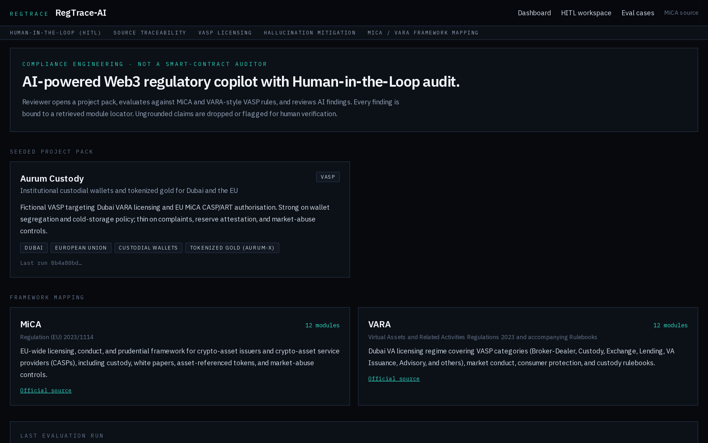
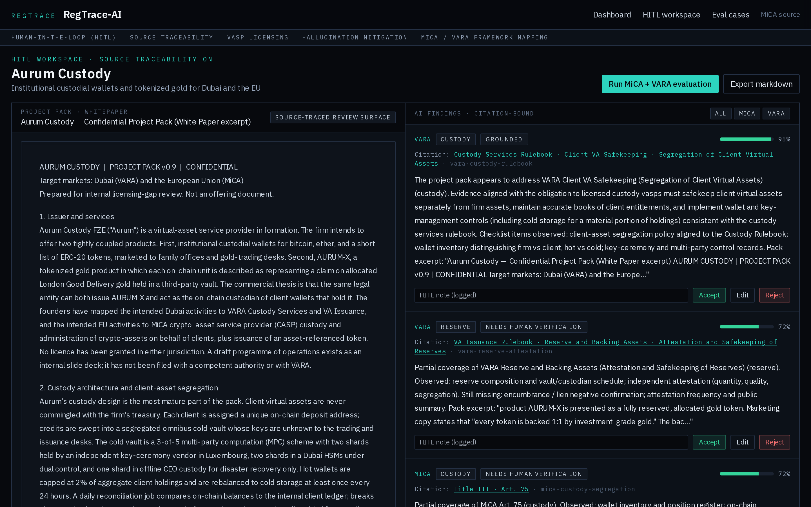
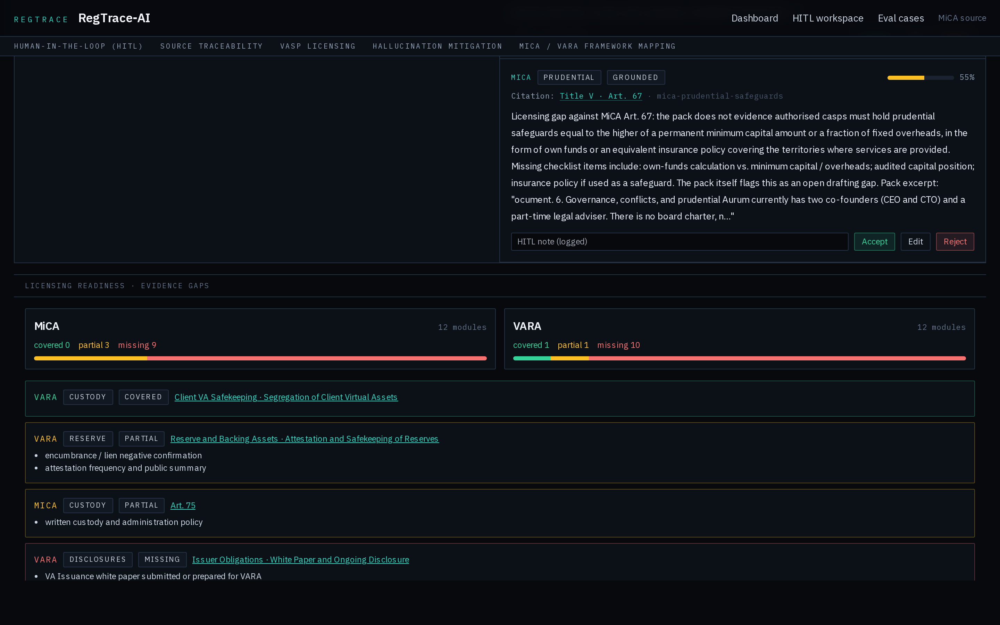

# RegTrace-AI

HITL Web3 compliance copilot for VASP licensing: source-traced MiCA / VARA mapping, hallucination flags, and a human review dashboard.

[](https://regtrace-ai.vercel.app)
[](https://github.com/devtechedge/regulatory_compliance/actions/workflows/ci.yml)
[](https://nextjs.org/)
[](https://fastapi.tiangolo.com/)
[](https://www.typescriptlang.org/)
[](LICENSE)

---

## Live Demo

[https://regtrace-ai.vercel.app](https://regtrace-ai.vercel.app)

> **Status:** Vercel demo-mode (Next.js API routes, seeded Aurum Custody, HITL reviews in-memory / reset on cold start). Local Compose remains the full FastAPI + Postgres path. Deterministic retrieval-bounded generator; no API key. Findings are not legal advice. CI on `main` is green (pytest, typecheck, Playwright).

Vercel project Root Directory is `frontend` (Next.js App Router demo API; FastAPI is not part of the Vercel build).

```bash
cp .env.example .env
docker compose up --build
```

Then http://localhost:3000 (web) and http://localhost:8000/docs (API).

---

## Screenshots

| Overview | HITL workspace |
|----------|----------------|
|  |  |

| Gap analysis |
|--------|
|  |

---

## Features

- HITL accept/edit/reject with logged eval cases
- Source-traced MiCA article and VARA rule citations
- Hallucination flags via citation validator
- 12 MiCA + 12 VARA VASP licensing modules
- Markdown gap export for the licence file

This is compliance engineering, not a smart-contract auditor.

---

## Tech Stack

| Layer | Technology |
|-------|------------|
| Frontend | Next.js App Router, TypeScript, Tailwind |
| API | FastAPI, SQLAlchemy 2, pydantic v2 (Compose / local); Next.js App Router demo routes on Vercel |
| Retrieval | BM25 + TF-IDF (no embedding API) |
| Data | Postgres in Compose; SQLite locally; seeded demo JSON on Vercel |
| Generator | Deterministic writer; optional OpenAI |
| Hosting | Vercel demo-mode (same-origin `/api`); Docker Compose for FastAPI + Postgres |

---

## Quick Start

### Vercel demo-mode (same-origin `/api`)

Leave `NEXT_PUBLIC_API_URL` empty. The Next.js app serves seeded Aurum Custody, framework JSON, and a snapshot evaluation from `frontend/app/api/*`. HITL reviews are in-memory and reset on cold start.

### Docker Compose (full FastAPI + Postgres)

Copy `.env.example` to `.env`, set `NEXT_PUBLIC_API_URL=http://localhost:8000`, then start postgres, api, and web with compose.

- API: http://localhost:8000/docs and GET /api/health
- Web: http://localhost:3000
- Postgres: localhost:5432 (user/password/db: regtrace)

No OpenAI key required.

### Local (no Docker)

Postgres is optional. The API defaults to SQLite if DATABASE_URL is unset.

From `backend/`, create a virtualenv, install the Python requirements file, export `DATA_DIR=../frontend/data` and a sqlite `DATABASE_URL`, then start uvicorn on `app.main:app` port 8000.

From `frontend/`, install Node dependencies. Leave `NEXT_PUBLIC_API_URL` empty to use the Next demo API, or export `NEXT_PUBLIC_API_URL=http://localhost:8000` to use FastAPI, then start the Next.js dev server.

Seed runs on API startup. To re-seed after wiping the DB, from backend/: `python -m app.seed`.

### Smoke

```
GET  /api/health
GET  /api/frameworks
POST /api/projects/aurum-custody/evaluate   {"frameworks":["MiCA","VARA"]}
```

## Tests

pytest backend/tests; frontend typecheck; Playwright from frontend/.

## License

MIT. See [LICENSE](LICENSE).

