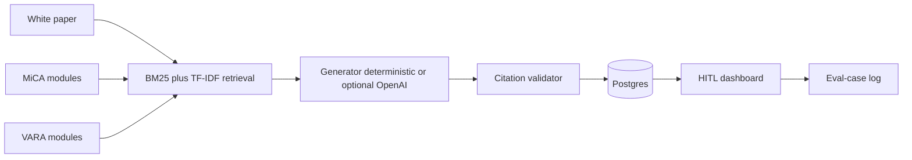

# RegTrace-AI

**Human-in-the-Loop (HITL) · Source Traceability · VASP Licensing · Hallucination Mitigation · MiCA / VARA Framework Mapping**

AI-powered Web3 **regulatory compliance copilot** plus a HITL audit dashboard. Built as a job-application project for **CertiK Compliance Engineer Intern** role (research, licensing gap analysis, structured regulatory mappings, AI output review, source traceability, hallucination mitigation, VASP licensing, MiCA / VARA).

This is **compliance engineering**, not a smart-contract auditor. It does not look for re-entrancy. It maps a project pack (white paper / tech spec) onto **MiCA** (EU Markets in Crypto-Assets, Regulation (EU) 2023/1114) and **VARA** (Dubai Virtual Assets Regulatory Authority) VASP-style obligations, then forces a human to accept, edit, or reject every material claim.

Live demo walkthrough: open `/` then the Aurum Custody card then `/projects/aurum-custody` split screen then run MiCA + VARA evaluation then click citations then Accept / Edit / Reject then `/reviews` eval-case log. Sample export: [`demo/sample-gap-report.md`](demo/sample-gap-report.md).

---

## Problem

VASP licensing reviews fail in the same places generative tools fail:

1. **Ungrounded answers** — models cite articles that do not exist, or paraphrase a rule without a locator.
2. **Missing HITL** — a gap report that a reviewer cannot accept/edit/reject is not an audit artefact.
3. **No framework mapping** — “you should have a complaints policy” without which MiCA article / VARA rulebook clause is not usable in a licence file.

RegTrace-AI is a small, inspectable pipeline that treats those as product requirements.

## What it does

- Loads **original paraphrases** of MiCA and VARA modules (8–12 per framework) with official source URLs and article / rule locators. **No large verbatim copyrighted regulation text.**
- Indexes modules with **BM25 + TF-IDF** (no embedding API required).
- Retrieves the modules that actually match the project pack, then generates findings **only from that retrieved set**.
- Runs a **citation validator** as a second pass: drop claims whose module id was not retrieved; flag claims whose key terms do not overlap the cited obligation; attach confidence from retrieval score.
- Stores **HITL overrides** (`accept` / `edit` / `reject`) with original vs override text, note, and timestamp — the eval set for hallucination mitigation.
- Exports a markdown **gap report** with clickable citations.

Seeded sample: **Aurum Custody**, a fictional Dubai+EU VASP offering custodial wallets and a tokenized gold product. Segregation and cold-wallet policy are relatively strong; complaints, reserve attestation, and market-abuse controls are gaps. That is what makes the evaluation interesting.

---

## Architecture



| Layer | Stack |
|---|---|
| API | FastAPI, SQLAlchemy 2, Postgres (SQLite works locally), pydantic v2 |
| Retrieval | rank-bm25 plus custom TF-IDF over obligation, keywords, checklist |
| Generator | Deterministic citation-bound writer; OpenAI only if OPENAI_API_KEY is set |
| Web | Next.js App Router, TypeScript, Tailwind — dark HITL workspace |
| Runtime | docker compose (postgres 5432, api 8000, web 3000) |

---

## Source traceability and hallucination guards

Every finding is a structured object, not a chat bubble:

| Guard | Behaviour |
|---|---|
| Retrieval-bounded generation | The generator only sees top-k retrieved modules. It cannot pick a random article. |
| Mandatory locator | Each finding stores citations with module_id, title, article/clause, and official URL. The UI renders them as links. |
| Citation validator (second pass) | If cited module id is not in the retrieved set, drop it. If claim tokens do not overlap the cited obligation / keywords, flag claim_terms_do_not_overlap_cited_obligation and mark unsupported. Unexpected Art. N strings that are not the cited locator go to needs_human_verification. |
| Confidence | 0.35 + 0.6 * retrieval_score, penalised by validator flags. |
| Status | grounded, needs_human_verification, or unsupported. Partial evidence always goes to HITL. |
| No-key path | Without OPENAI_API_KEY the API still evaluates, using a deterministic writer that templates claims from the cited obligation plus pack checklist overlap. Compose works with no API key. |

Ungrounded claims never reach the export as if they were law.

## HITL overrides

POST /api/findings/{id}/review with action, optional override_text and note writes a ReviewAction row:

- original claim preserved
- optional override text (edits)
- reviewer note
- timestamp

GET /api/eval-cases is the eval log (also the /reviews page). Accepting a needs_human_verification finding promotes it to grounded only after a human signs it. Rejecting marks unsupported and tags hitl_rejected.

---

## Run

### Docker Compose (preferred)

Copy `.env.example` to `.env`, then start postgres, api, and web with compose.

- API: http://localhost:8000/docs and GET /api/health
- Web: http://localhost:3000
- Postgres: localhost:5432 (user/password/db: regtrace)

No OpenAI key required.

### Local (no Docker)

Postgres is optional. The API defaults to SQLite if DATABASE_URL is unset.

From `backend/`, create a virtualenv, install the Python requirements file, export `DATA_DIR=../data` and a sqlite `DATABASE_URL`, then start uvicorn on `app.main:app` port 8000.

From `frontend/`, install Node dependencies, export `NEXT_PUBLIC_API_URL=http://localhost:8000`, then start the Next.js dev server.

Seed runs on API startup. To re-seed after wiping the DB, from backend/: `python -m app.seed`.

### Smoke

```
GET  /api/health
GET  /api/frameworks
POST /api/projects/aurum-custody/evaluate   {"frameworks":["MiCA","VARA"]}
```

## HTTP API

| Method | Path | Purpose |
|---|---|---|
| GET | `/api/health` | Liveness + generator mode + module counts |
| GET | `/api/frameworks` | MiCA / VARA + module counts |
| GET | `/api/projects` | Seeded projects |
| GET | `/api/projects/{id}` | Pack documents |
| POST | `/api/projects/{id}/evaluate` | Retrieval, generate, validate, persist |
| GET | `/api/runs/{id}` | Findings, gaps, HITL actions, readiness counts |
| POST | `/api/findings/{id}/review` | accept, edit, or reject |
| GET | `/api/runs/{id}/export.md` | Markdown gap report |
| GET | `/api/eval-cases` | HITL override log |

---

## Walkthrough (Aurum Custody)

```
Dashboard: Aurum Custody card, MiCA + VARA module counts, last run.
HITL workspace (split screen):
  LEFT  project pack (segregation / cold MPC strong; complaints & attestation thin)
  RIGHT findings with Art./rule citations, confidence, Accept / Edit / Reject
  BOTTOM licensing readiness: covered / partial / missing per framework
Eval-case log: original vs override + reviewer note + timestamp
```

1. Dashboard shows the seeded pack and both frameworks.
2. Workspace: left pane is the white paper; right pane is citation-bound findings.
3. Click an article link (EUR-Lex or vara.ae). Edit opens an inline textarea; the override is logged.
4. Export downloads the same shape as [`demo/sample-gap-report.md`](demo/sample-gap-report.md).
5. `/reviews` lists every HITL action for later eval / prompt regression.

---

## Data (not placeholder text)

- [`data/frameworks/mica.json`](data/frameworks/mica.json) — Title II–VI paraphrases (CASP authorisation, white paper, ART reserve/redemption, custody Arts. 70/75, conflicts, prudential, complaints, market abuse, governance, outsourcing). Locators: https://eur-lex.europa.eu/eli/reg/2023/1114/oj
- [`data/frameworks/vara.json`](data/frameworks/vara.json) — VASP licensing, Custody Services Rulebook, Company Rulebook, Market Conduct, VA Issuance, AML/CFT, technology, prudential. Locators: https://www.vara.ae/en/rules-and-regulations/
- [`data/projects/aurum-custody.json`](data/projects/aurum-custody.json) — original project pack written for this repo.

## Repo layout

```
regulatory_compliance/
  README.md  LICENSE  docker-compose.yml  .env.example
  demo/sample-gap-report.md
  data/frameworks/{mica,vara}.json
  data/projects/aurum-custody.json
  backend/          FastAPI app
  frontend/         Next.js App Router
```

MIT (c) 2026 Devayan Mandal
